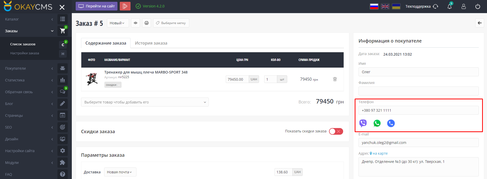

# Кнопки быстрого обмена сообщениями (Viber, WhatsApp)
Module FastMessengerButtons (OkayCMS_4.2.0)

Данный модуль выводит кнопки быстрого перехода в чат с клиентом для Viber, Whatsapp, и кнопку вызова по номеру телефона на страницах подробного заказа в поле "Информация о покупателе" под номером телефона клиента. Также можно отключить отображение кнопок в "Настройки отображения кнопок".

  
 

# Результат работы модуля

На странице заказа под номером телефона клиента выводятся иконки мессенджеров. При нажатии на иконку (кнопку) открывается чат по номеру телефона который указал клиент.

# Зачем мне этот модуль?

Данный модуль позволит быстрее и удобнее связываться с Вашими клиентами. Вам не потребуется корректировать номер телефона добавляя недостающие символы, такие как +380, (+7), не потребуется копировать номер телефона, открывать нужный мессенджер и производить поиск клиента в нем. Модуль всё сделает за Вас! Вам остается только написать клиенту.

